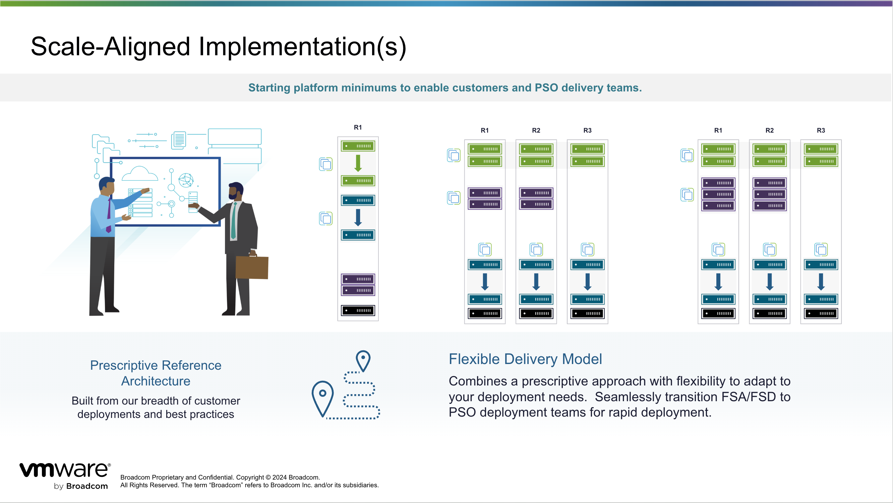
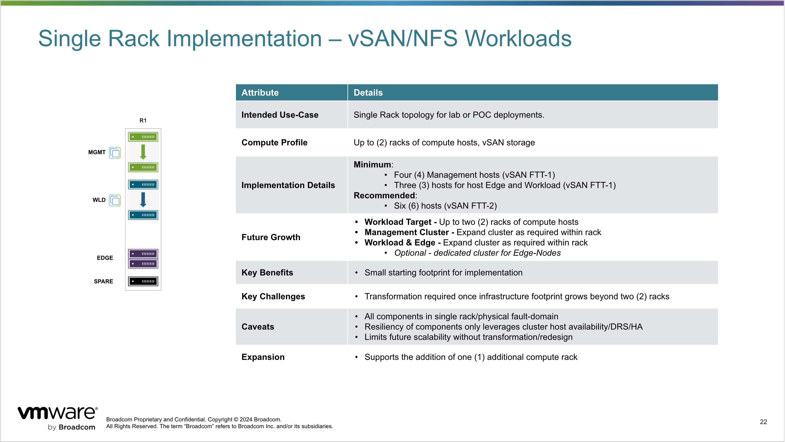
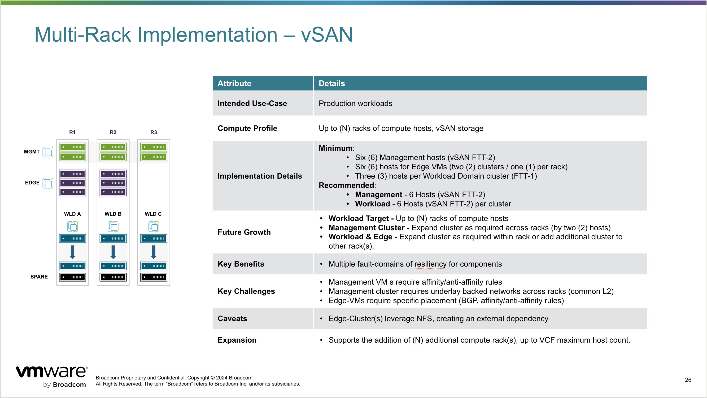
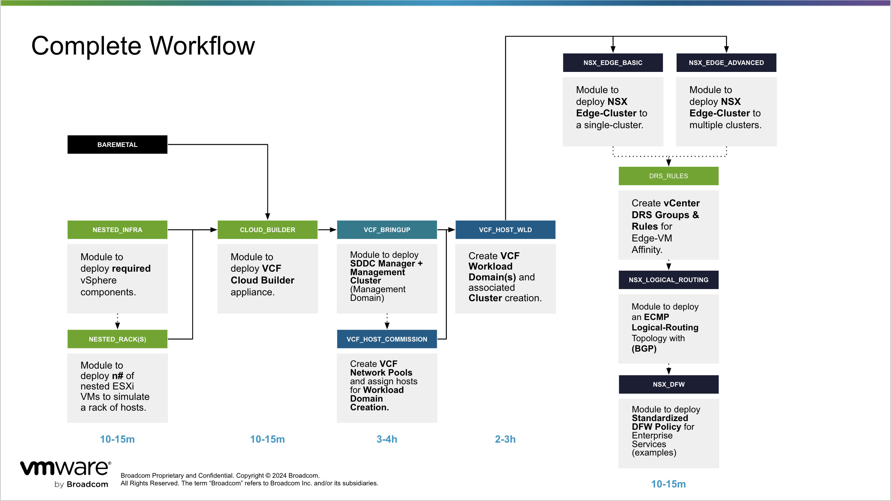

# VMware Professional Services - IaC Toolkit for Terraform - 1.3

This is a toolkit for deploying VMware Platforms for customer ready consumable infrastructure.  It includes prescriptive deployment patterns and topologies for automated deployment of VCF and NSX configurations.

The toolkit is built with the principle of Infrastructure as Code (IaC) which is a methodology that allows management and provisioning of infrastructure using code rather than manual processes.  This means that all infrastructure components, including servers, networks, storage, and policies are defined and managed through code.  Many "Day-0" workflows have been modularized into reusable components/modules, promoting code reuse, simplifying maintenance, and enabling scalability.

This approach brings automation, consistency, and scalability to infrastructure configurations of customer deployments.

Terraform is used as the primary tool for defining, managing, and provisioning infrastructure. It provides a declarative language for describing infrastructure components and automates the deployment process.

# Automation Overview

This tool kit includes Terraform modules to deploy VMware Appliances, VMware Cloud Foundation and various NSX topologies. The appliances are deployed using small/est form-factors to reduce total footprint.  *Some post-provisioning is required to finalize and customize each of the platforms in this version of the toolkit.*




## Hashicorp Registry

Terraform Providers:

- [VCF](https://registry.terraform.io/providers/vmware/vcf/latest) for Cloud Builder deployment, SDDC Manager, Management Domain creation and Workload Domain creation.
- [NSX](https://registry.terraform.io/providers/vmware/nsxt/latest) for NSX Edge-Cluster deployment, Logical Routing and Firewall configuration(s).
- [vSphere](https://registry.terraform.io/providers/hashicorp/vsphere/latest) for meta data management, DRS and administration (Folders, Resource-Pools and Port-Groups). 
  
## Single Rack Model

This deployment model is suitable for lab, certification or small site configurations. Default configuration assumes one (1) fault-domain.



### Rack Layout

- One (1) Compute rack to seed the deployment
- vSAN based storage cluster(s)

### Edge-Cluster Model (Single Rack)

- Single (1) fault-domain topology
- Edge-VMs are deployed alongside workload VMs or to a single (1) dedicated cluster.

### Pre-Requisites

For pre-requisites [See Here](/docs/prereqs_single_rack.md)

## Private Cloud Models

These deployment models are suitable for production enterprise-grade site configurations.  Default configuration requirement minimum of three (3) fault-domains where each rack represents an FD/AZ.

### Rack Layout(s)

- Three (3) Compute racks
- vSAN or NFS based storage cluster(s)




### Edge-Cluster Model (Private Cloud)

- Two (2) rack/fault-domain topology, with a minimum of two (2) clusters for edge compute resources.  This model can support horizontal (additional clusters) and vertical expansion (additional hosts per cluster).
- Edge-VMs are deployed across two (2) dedicated clusters and split evenly across the fault-domains.

## Automation for Networking and Security deployment materials

 Terraform Modules to deploy the following components:

    - Edge-Cluster
        - Uplink Profile
        - VLAN Transport Zone
        - Uplink Segments

    - NSX-T Edge-VMs
        - A minimum of two (2) and maximum of eight (8).

    - Logical-Routing configuration leveraging BGP (ECMP)
        - Tier-0
            - BGP Config, Uplinks, Timers, ASN
            - Prefix-List(s)
            - Route-Map(s)
        - Tier-1(s)
        - Workload Segment(s)

    - Distributed Firewall Macro-Segmentation Example(s)

## Example VCF Workflow

The figure below depicts how workflows can be run individually and their order, but also how an end-to-end workflow can be constructed.



## Getting Started

To get started with this toolkit use the following steps:

### Step 1

Download Terraform version 1.4 or newer. Using package managers or manual binary download methods.

https://www.terraform.io/downloads.html

``` sh
$ brew install hashicorp/tap/terraform
```

### Step 2

Install git.  Using package managers or manual binary download methods.

* Binaries - https://git-scm.com/downloads
* Install Guide - https://github.com/git-guides/install-git

``` sh
$ brew install git
```
or
``` sh
$ sudo apt-get install git-all
``` 

### Step 3

Using an IDE like VS Code, clone the project repository.

``` sh
$ git clone https://github.com/vmware/terraform-vcf-toolkit.git
```

### Step 4

Fill out the **\*.tfvars** files for each of the Modules of the deployment.

The variables can be combined into a single **\*.tfvars** and leveraged for all deployment Modules.
