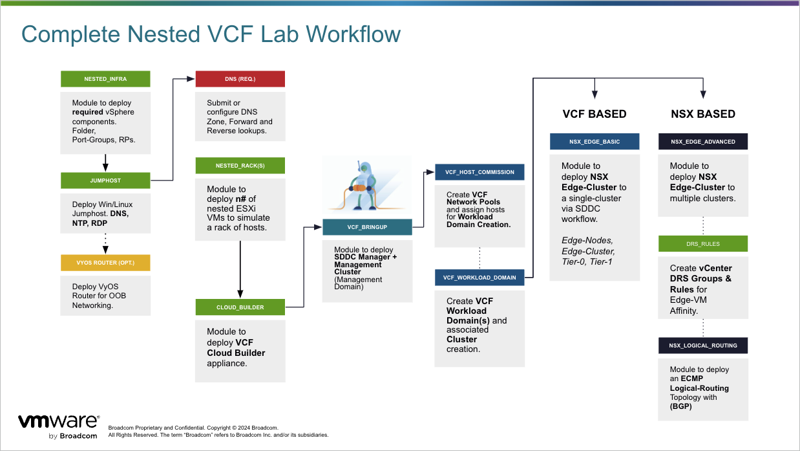

# VCF Nested Lab

This library item will deploy the neccessary infrastructure to configure a nested or POC instance of VCF.



## Overview

The deployment includes:
- Top level (root) vSphere components such as Folder, Resource Pools and Port-Groups
- At least four (4) nested ESXi VM appliances for VCF Bringup.
- The VCF Cloud Builder appliance.
- A virtual router (VyOS) appliance with relevent configuration delivered as part of clound-init.

The deployment _does not_ include:
- Jumphost images and DNS configuration.

Any VCF bringup plan may be run after these components are deployed.  Examples can be found in /library/vcf/bringup*

## Required Software 
1. Nested VMware ESXi Appliance - [Link](https://support.broadcom.com/group/ecx/productdownloads?subfamily=Flings)
2. VCF Installer - [Link](https://support.broadcom.com/group/ecx/productfiles?subFamily=VMware%20Cloud%20Foundation&displayGroup=VMware%20Cloud%20Foundation%209&release=9.0.0.0&os=&servicePk=&language=EN)
   
## Optional Software 
1. VyOS - v1.2.9-S1 (cloud-init)


# Getting Started - Terraform

To get started with this toolkit use the following steps:

### Step 1 - Download

Download Terraform. Using package managers or manual binary download methods.

https://www.terraform.io/downloads.html 

```
$ brew install hashicorp/tap/terraform
```

### Step 2 - Install

Install git.  Using package managers or manual binary download methods.

* Binaries - https://git-scm.com/downloads
* Install Guide - https://github.com/git-guides/install-git

```
$ brew install git
```
or
```
$ sudo apt-get install git-all
```

### Step 3 - IDE Environment

Using an IDE like VS Code, clone the project repository.  Presumably you have this completed.

```
git clone https://vmw-gitlab.com/st034044/PS_TF_Toolkit.git
```

### Step 4 - Parameters and Library Item creation

Fill out the associated **\*.tfvars** file to pass in for this deployment plan.  _You may optionally fill out the module {} configuration._

### Step 5 - Running Terraform

1. Initialize Terraform and install the required Providers and Modules by running:
```
$ terraform init
```

2. Plan the deployment and validate configuration.
```
$ terraform plan -out lab1 -var-file="vcf_nested_lab.tfvars"
```
3. Apply the configuration
```
$ terraform apply lab1
```
4. Destroy the deployment for repaving.
```
$ terraform destroy -var-file="vcf_nested_lab.tfvars"
```