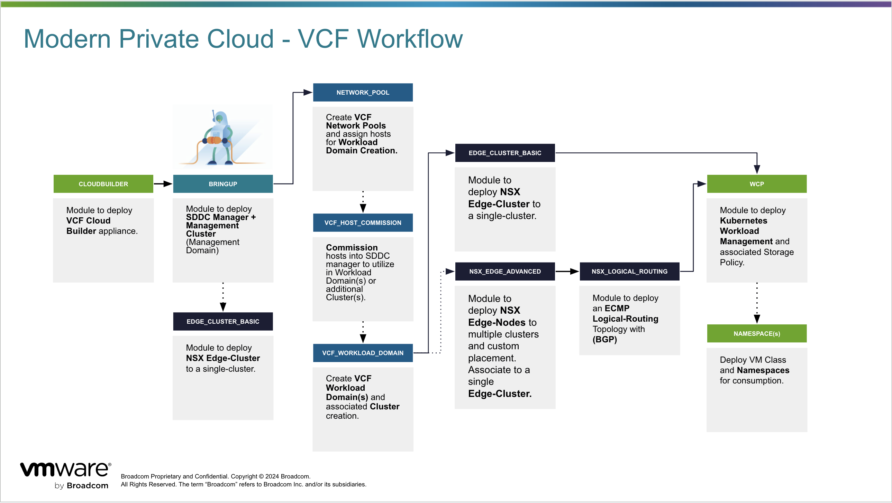

# VMW Professional Services Workflow for VCF v1.0

This library item is a collection of modules in an organized workflow to deploy VMware Cloud Foundation v5.2.1 with Terraform.  This workflow will guide users through the following stages:



## Getting Started

Terraform, Git, and an Integrated Development Environment (IDE) will need to be downloaded on the computer that you want to execute the Terraform modules from. In this example, we will be installing Terraform and Git on a MAC. If you already have Terraform and Git installed, please skip to the [IDE](#ide) section to pull down the PSO_TF_Toolkit repository.

### Install Terraform

Download Terraform using package managers or manual binary download methods.

[Install Terraform](https://www.terraform.io/downloads.html)

```sh
brew tap hashicorp/tap
brew install hashicorp/tap/terraform
```

### Install Git

Install Git using package managers or manual binary download methods.

* [Git Binaries](https://git-scm.com/downloads)
* [Git Install](https://github.com/git-guides/install-git)

```sh
brew install git
```

### IDE

Using an IDE like VS Code, clone the project repository.

```sh
git clone https://github.com/vmware/terraform-vcf-toolkit.git
```

# Execution

Users may choose how to execute these modules in one of two ways.

## Option 1 - Filling out the module parameters directly

This is the simplest way to consume the Terraform Modules and Plans.  

The workflow will be:

1. Fillout **module.tf**
2. `terraform init` > `terraform plan -out stage# -var-file="module.tfvars"` > `terraform apply stage#`

## Option 2 - TFVARS

Using the provided placeholder `module-example.tfvars` files for each of the stages.  This requires filling out the place holders for a more repeatable reference deployment template.

The workflow will be:

1. Create the **variables.tf** and define reference for each of the required variables.
   * `variable "parameter" {}`

2. Fillout **module.tf** with variable placeholders
   * `parameter = var.paramenter`
  
3. Fillout **module.tfvars** by adding the the parameters required in the given variable.

4. `terraform init` > `terraform plan -out stage# -var-file="module.tfvars"` > `terraform apply stage#`

**Note:**
*This processes may feel redundant but can be powerful when you have a static framework / library item to follow and will be able to apply a number of different `*.tfvars` such as building multiple sites, labs or repeatable tasks.*

## Stage 1 | Cloudbuilder Appliance

`modules/appliances/cloudbuilder` - [Cloud Builder Deployment](../../../modules/appliances/cloudbuilder/README.md)

* This module will deploy a VCF Cloudbuilder appliance from either a Content Library (pref.) or Local OVA.

## Stage 2 | VCF Management Domain Bringup

`modules/vcf/bringup_5.2.1` - [VCF Management Domain Bringup](../../../modules/vcf/bringup_5.2.1/README.md)

* This module will deploy and configure at least four (4) hosts to complete the VCF Bringup process in which vCenter and NSX appliances are deployed.  Hosts are prepared for NSX and added to a vSphere cluster.

## Stage 3 | VCF Edge-Cluster for Management and Operations (Application Virtual Networks / AVN)

`modules/vcf/nsx_edge_cluster`

* This module will deploy and configure an NSX Edge-Cluster and configure Logical-Routing with BGP to provide connectivity and Overlay networking for the VCF Operations Suite.

## Stage 4 | Network Pool Definition

`modules/vcf/network_pool`

* This module configures Network Pool(s) for IP range and VLAN definition.  These may be aligned to racks or cluster level objects for tracking.

## Stage 5 | Host Commissioning

`modules/vcf/host_commission`

* This module configures BOM aligned ESXi hosts into their associated Network Pool(s) and leveraged as free resources when deploying additional Workload Domains or new cluster(s) within the VCF instance.

## Stage 6 | Workload Domain Creation

`modules/vcf/workload_domain`

* This module will deploy and configure at least four (4) hosts to deploy a new vCenter and NSX appliances.  Hosts are added to a vSphere cluster and prepared for NSX.

## Stage 7 | NSX Edge-Cluster for Workload Domain

`modules/vcf/nsx_edge_cluster`

* This module will deploy and configure an NSX Edge-Cluster and configure the Tier-0 Logical-Router with BGP networking to provide connectivity and Overlay networking for Workload VM connectivity (similar to the Management Edge AVN deployment).

* A default VCF deployed Edge-Cluster will deploy all of its Edge-Nodes to a single cluster.

* *Optionally, a more advanced workflow can deploy Edge-Nodes based on a more elaborate fault-domain placement.*
  * `/modules/nsx/edge_deployment`
  * `/modules/nsx/logical_routing_dynamic`

## Stage 8 | vSphere Kubernetes Workload Management - Supervisor Cluster

`modules/vsphere/storage_policy`

`modules/vsphere/supervisor_cluster`

These modules will configure TKGS requirements such as a new Storage Policy and Tags in order to support the configuration of the k8s Supervisor Cluster.
