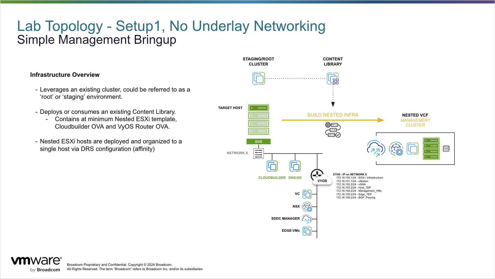
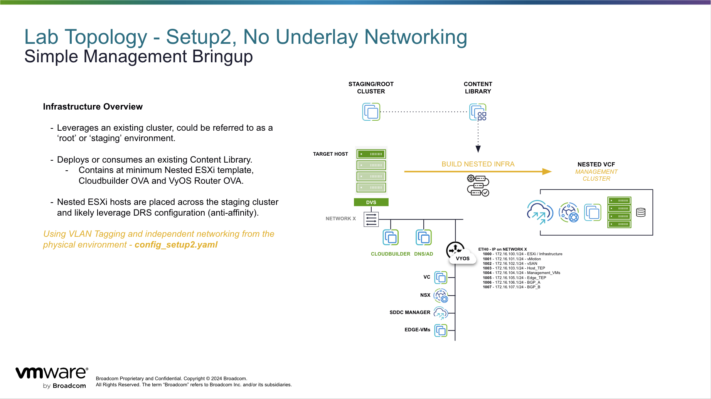

# Lab Router - VyOS 1.2.9-S1

This is a simple virtual router to manage VLAN and routing configuration for homelab, development or POC environments.  

Using this module, users can:

* Deploy untagged and/or tagged VLAN configurations to support infrastructure.

* Add multiple interfaces to organize traffic.

* Support for DHCP/Forwarding, Jumbo Frames, NAT, etc.

* BGP peering.

[OVA 1.2.9-S1 (with cloud-init)](https://mails.vyos.io/e3t/Ctc/5B+113/cvc-W04/VVrMG922bBFRW68vgDP7YF5f7W4Mw1s55hg2MbN1HNy-b3lYMRW7lCdLW6lZ3m_W42hXSg1vTsL4W5bPkHb7z4BQrW5hF_3R4XhDkLW2mv0Rt7PMZz5N8T5rQL9CZVtVMtyrH8x-yjpW1wZTJf75XHwDW7GyrTm771PLgW1tvghd7mzxZ_W7PNwtd2c36vQVQSD7Y4jCrnYW1yQ1dB4TS22WW2pDQfS7xK8wzW2djb1G5fmh_JN4Xgp9Mcl2D4W9bDlXK60q9QmN54NYBmCRJwhW7YdqDW7Zqk2CW84pW2G1qx9NQN3B8bpmK2YCMW6mTc577MKT-XVlT0zt6JnnQMW7QCPx_1zMknyW4k3_vy4PCZdsf8sgQ1T04)

## Default Setup1 - Example

**Setup1** deployment will utilize one (1) interface configured with an IP address on an untagged VLAN. VCF networks are configured on the same interfaces as untagged VLANs.

This configuration can be loaded or modifed from the `config_setup1.yaml` file located in this directory `/modules/lab/router_vyos`.  It is the simplest setup and allows for a deployment across your underyling infrastructure with the only requirement being ***VLAN 0 / untagged packets are allowed.***

### General Interface Config

ETH0 - ##.##.##.##/# (Routable Network)

* 172.16.100.0/24 - Infra
  * DNS/NTP/DHCP/Jumphost
  * ESXi hosts
* 172.16.101.0/24 - vMOTION
* 172.16.102.0/24 - vSAN
* 172.16.103.0/24 - Host_TEP
* 172.16.104.0/24 - Management_VMs
* 172.16.105.0/24 - Edge_TEP
* 172.16.106.0/24 - BGP

BGP can be configured with an untagged VLAN but will not be supported directly via VCF. Custom workflows can simply use a single NSX Segment/DVPG (untagged).

* VCF workflows for out-of-the-box Edge-Cluster(s) require two (2) networks with associaged VLAN IDs. (See **Setup2**)

## Setup2 - Tagged VLANs

**Setup2** deployment will utilize one (1) interface. ETH0 configured with an IP address on any routable network, tagged or untagged.  ETH0 will contain all of the sub-interfaces which are configured as virtual-interfaces (VIF) interfaces using VLAN IDs.

This setup works best when deploying to a single ESXi host, as packets will not be leaving the host uplinks and does not require network config on the underlay/physical switchports.

This configuration can be loaded or modifed from the `config_setup2.yaml` file located in this directory `/modules/lab/router_vyos`

### General Interface Config

ETH0 - ##.##.##.##/# (Routable Network) attached to TRUNK DVGP (0-4094)

* VIF 1000 - 172.16.100.0/24 - ESXI
* VIF 1001 - 172.16.101.0/24 - vMOTION
* VIF 1002 - 172.16.102.0/24 - vSAN
* VIF 1003 - 172.16.103.0/24 - Host_TEP
* VIF 1004 - 172.16.104.0/24 - Management_VMs
* VIF 1005 - 172.16.105.0/24 - Edge_TEP
* VIF 1006 - 172.16.106.0/24 - BGP_A
* VIF 1007 - 172.16.107.0/24 - BGP_B

## Setup3 - Tagged VLANs / Multiple Interfaces

**Setup3** deployment will utilize two (2) interfaces. ETH0 configured with an IP address on any routable network, tagged or untagged.  ETH1 will contain all of the sub-interfaces and are configured as virtual-interfaces (VIF) interfaces using VLAN IDs.

This configuration can be modifed from the `config_setup2.yaml` file located in this directory `/modules/lab/router_vyos`

ETH0 - ##.##.##.##/# (Routable Network)

ETH1 - Multi-Network (Trunk)

* VIF 1000 - 172.16.100.0/24 - ESXI
* VIF 1001 - 172.16.101.0/24 - vMOTION
* VIF 1002 - 172.16.102.0/24 - vSAN
* VIF 1003 - 172.16.103.0/24 - Host_TEP
* VIF 1004 - 172.16.104.0/24 - Management_VMs
* VIF 1005 - 172.16.105.0/24 - Edge_TEP
* VIF 1006 - 172.16.106.0/24 - BGP_A
* VIF 1007 - 172.16.107.0/24 - BGP_B
  
## Common Issues / Troubleshooting

Deployment show-stoppers can generally be attributed to formatting in the `config_setup#.yaml` file.  This file is base64encoded and passed in to the VM through the `user-data` field and then leverages 'cloud-init' config during the boot.

1. If the final parameter in the command is not surrounded by ``, it will likely fail to parse the YAML config correctly leading to a bad encoding and the router will subsequently fail to load the config.

2. Attempting to apply configuration to an incorrect interface mapping.  For example, ETH2 configurations, but the VM is only configured with ETH0 and ETH1.
