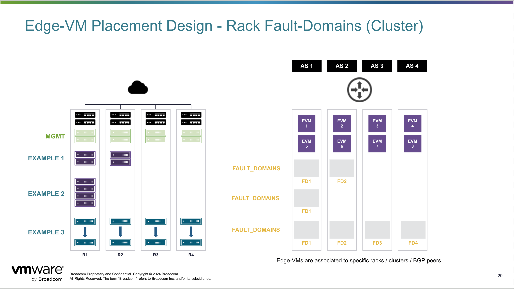

# NSX Edge-Cluster Deployment

This module will allow the user to deploy any number of NSX Edge-VMs to an existing NSX Domain and configure them into an Edge-Cluster.  Additional configuration can be deployed via the modules located in `/modules/nsx/logical_routing_x`.



### Creates the following objects:

- `fault_domain` meta object for basic or advanced placement of Edge-Nodes across the vSphere/NSX Domain.
- `ip_pool` object(s) for static IP assignment of the Tunnel-Endpoint interface.
- `uplink_profile` object for the Edge-Node which will contain criteria for GEVENE tagging, Teaming-Policies, etc.
- `port_groups` static TRUNK Distributed Port-Groups with default names.
- A variable number of `edge_vms` placed according to the `fault_domain` mapping.
- A single `edge_cluster`.
- `anti_affinitiy_rule` in which the VMs will attempt to run away from one another.
- `transport_zones`
  - Discover a user-defined or VCF defined Transport-Zone
  - Create a user-defined VLAN Transport-Zone

## General Usage

The logic of this module will decide where to place Edge-VMs based on the `fault_domain` construct.  by default, a single fault-domain is defined for the Nodes to be placed.  This is aligned to the same logic as SDDC Manager, but allows more manipulation after the deployment.

``` bash
variable "fault_domain" {
  description = "Fault-Domains for Edge-VMs to be deployed into.  These are based on Rack/Cluster locale."
  type = map(object({
    compute_manager = string
    datacenter      = string
    cluster         = string
    datastore       = string
    dvs             = string
    resource_pool   = optional(string, "edge_vms")
    folder          = optional(string, "edge_vms")
  }))
}
```

### Example 1 - Single-Rack

~~~ bash
# --------------------------------------------------------------- #
# Specify Fault-Domain mapping constructs.
#  - Each domain is represented with a map. fd# = {}
# --------------------------------------------------------------- #
fault_domain = {
  fd1 = {
    compute_manager = "wld01-vc.mpc.lab1"
    datacenter      = "dc01"
    cluster         = "cl01"
    datastore       = "cl01-vsan"
    dvs             = "cl01-vds"
  }
}

#--------------------------------------------------------------- #
# Edge-Cluster and associated Edge-VMs to be deployed.
#   - Default mapping is for all VMs into 'fd1'
# --------------------------------------------------------------- #
edge_vms = {
  edge-vm1 = {
    mgmt_ip   = "172.16.104.100/24"
    mgmt_gw   = "172.16.104.1"
    uplinks   = ["uplink1", "uplink2"]
    passwords = {}
  },
  edge-vm2 = {
    mgmt_ip   = "172.16.104.101/24"
    mgmt_gw   = "172.16.104.1"
    uplinks   = ["uplink1", "uplink2"]
    passwords = {}
  }
}
~~~

### Example 2 - Multi-Rack

``` bash
# --------------------------------------------------------------- #
# Specify Fault-Domain mapping constructs.
#  - Each domain is represented with a map. fd# = {}
# --------------------------------------------------------------- #
fault_domain = {
  fd1 = {
    compute_manager = "wld01-vc.mpc.lab1"
    datacenter      = "dc01"
    cluster         = "cl01"
    datastore       = "cl01-vsan"
    dvs             = "cl01-vds"
  },
  fd2 = {
    compute_manager = "wld01-vc.mpc.lab1"
    datacenter      = "dc01"
    cluster         = "cl02"
    datastore       = "cl02-vsan"
    dvs             = "cl02-vds"
  }
}

# --------------------------------------------------------------- #
# Edge-Cluster and associated Edge-VMs to be deployed.
#   - Utilize previously named fd# mapping to place accordingly.
# --------------------------------------------------------------- #
edge_vms = {
  edge-vm1 = {
    mgmt_ip      = "172.16.104.100/24"
    mgmt_gw      = "172.16.104.1"
    uplinks      = ["uplink1", "uplink2"]
    fault_domain = "fd1"
    passwords    = {}
  },
  edge-vm2 = {
    mgmt_ip      = "172.16.104.101/24"
    mgmt_gw      = "172.16.104.1"
    uplinks      = ["uplink1", "uplink2"]
    fault_domain = "fd2"
    passwords    = {}
  },
  edge-vm3 = {
    mgmt_ip      = "172.16.104.102/24"
    mgmt_gw      = "172.16.104.1"
    uplinks      = ["uplink1", "uplink2"]
    fault_domain = "fd1"
    passwords    = {}
  },
  edge-vm4 = {
    mgmt_ip      = "172.16.104.103/24"
    mgmt_gw      = "172.16.104.1"
    uplinks      = ["uplink1", "uplink2"]
    fault_domain = "fd2"
    passwords    = {}
  }
}
```

## Limitations

- Supports a single `uplink_profile` which enforces the same VLAN ID in each fault-domain.
- Supports multiple clusters as the `fault_doamin` mechanic, single cluster placement across racks, is not supported at this time, unless the DRS rule placement is modified.
  - Default `anti_affinity_rule` will look to enforce VMs run away from each other within the same `fault_domain`.
  - Future-state will leverage host definition within the `fault_domain` construct.
